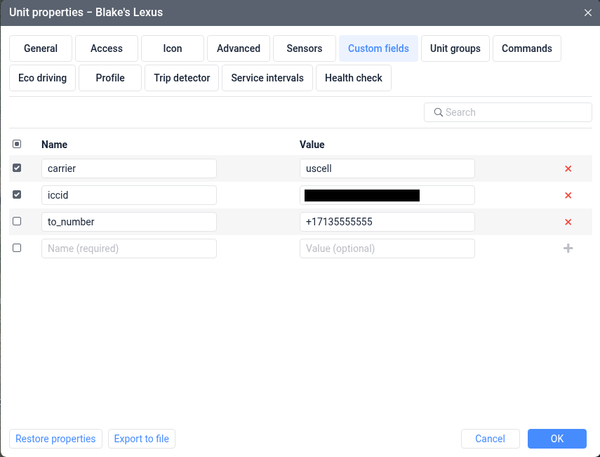
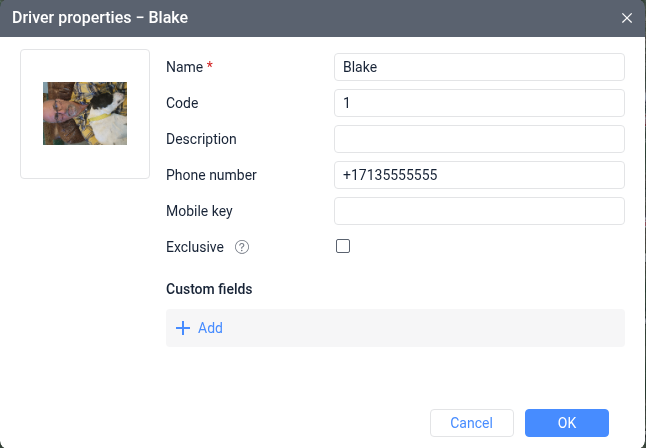

Setting destination phone numbers
=================================

When your notifications are triggered, our `notification dispatcher`_ uses the `Wialon API`_ to retrieve a list of destination phone numbers.

Phone numbers retrieved from :ref:`custom field <custom-field>` and/or :ref:`attached driver <attached-driver>` are combined into a list by the notification dispatcher. Duplicate phone numbers are discarded during this combination step.

Each destination phone number recieves a message, i.e. **one notification trigger** with **three destination phone numbers** is counted as **three messages**.

.. important:: All phone numbers must be in `E.164`_ format, with a leading `+`. Example: ``+17135555555``

.. note:: Our notification dispatcher caches data retrieved from the Wialon API for 5 minutes.

   If you update custom field ``to_number`` or attach/detach a driver, you may have to wait up to 5 minutes before those changes are reflected by our notification dispatcher.

.. _custom-field:

============
Custom field
============

If the triggering Wialon unit has a custom field of key ``to_number``, its value is retrieved for delivery.

The value of this custom field may be a single `E.164`_ formatted phone number or a comma-separated list of E.164 formatted phone numbers.

**ACCEPTABLE**:

* ``+17135555555``
* ``+17135555555,+18325555555``

**UNACCEPTABLE**:

* ``7135555555``
* ``713-555-5555``
* ``+17135555555 +18325555555``

.. _attached-driver:

===============
Attached Driver
===============

If the triggering Wialon unit has an attached driver, the attached driver phone number is retrieved for delivery.

As with :ref:`custom field <custom-field>`, driver phone number must be in `E.164`_ format.

.. _E.164: https://en.wikipedia.org/wiki/E.164
.. _notification dispatcher: https://github.com/terminusgps/terminusgps-notifier/
.. _Wialon API: https://help.wialon.com/en/api/user-guide/api-reference
